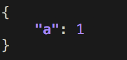

# [pprintjson](https://pypi.org/project/pprintjson/)

[](https://pypi.org/project/pprintjson/)

A json pretty printer for Python 🐍.

## Installation

```bash
$ pip install pprintjson
```

## Usage

```python

# 1. import the "pprintjson" function.
from pprintjson import pprintjson as ppjson

# 2. pretty print JSON.
obj = { "a": 1, "b": "string", "c": True }

ppjson(obj)
```



## License

MIT &copy; [**Travis Clarke**](https://blog.travismclarke.com/)
